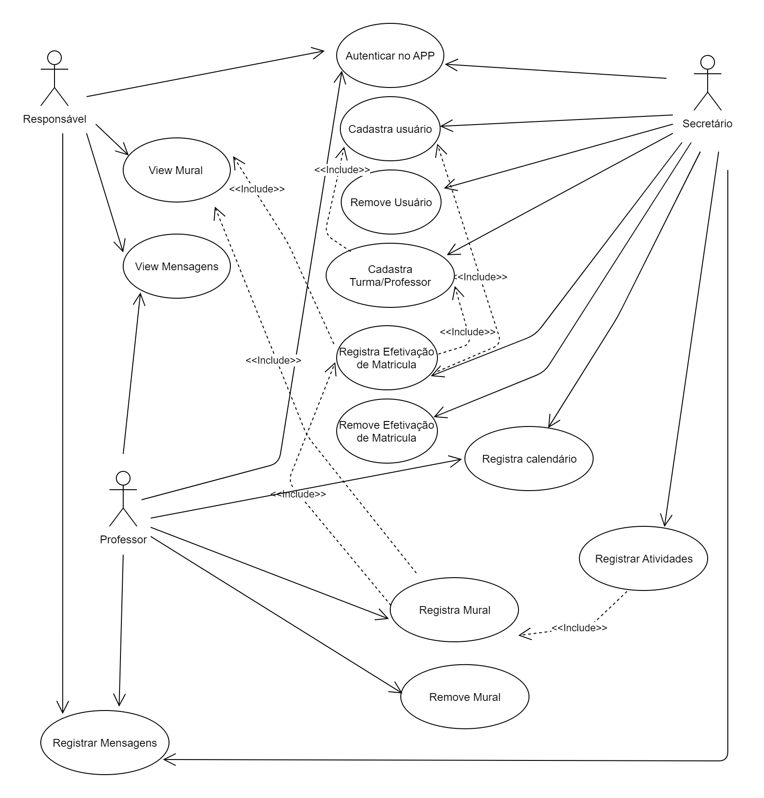

# Especificações do Projeto

Pré-requisitos: <a href="1-Documentação de Contexto.md"> Documentação de Contexto</a>

Definição do problema e ideia de solução a partir da perspectiva do usuário. É composta pela definição do  diagrama de personas, histórias de usuários, requisitos funcionais e não funcionais além das restrições do projeto.

Apresente uma visão geral do que será abordado nesta parte do documento, enumerando as técnicas e/ou ferramentas utilizadas para realizar a especificações do projeto

## Personas

## Clara Oliveira

## Profissão: Professora de Ensino Infantil

### Idade: 30 anos

**Hobbies:**  Leitura e atividades ao ar livre.

**Motivações:** Aprimorar a comunicação com os pais para garantir organização eficiente das atividades diárias e agilizar a repetitiva atividade de escrever bilhetes nas agendas dos alunos.

**Frustrações:** Dificuldades na troca de informações com os pais, falta de ferramentas eficientes para a gestão de tarefas escolares.

## Marcos Silva

## Profissão: Professor de Ensino Infantil

### Idade: 35 anos

**Hobbies:**  Música e esporte.

**Motivações:** Agilizar a comunicação com os pais e garantir uma organização eficaz das tarefas escolares.

**Frustrações:** Sobrecarga na gestão de comunicação w falta de uma ferramenta que otimize o planejamento e execução de atividades.

## Maria Santos

## Profissão: Arquiteta

### Idade: 32 anos.

**Hobbies:** Fotografia e jardinagem

**Motivações:** Acesso fácil às informações sobre o desempenho e atividades diárias de João na escola.

**Frustrações:** Dificuldades em obter informações oportunas e relevantes sobre o progresso do filho na escola sem precisar ir presencialmente a ela, falta de praticidade na comunicação com os professores.

## Paulo Oliveira

## Profissão: Engenheiro de Software

### Idade: 36 anos.

**Hobbies:** Cozinhar e prática de esportes.

**Motivações:**  Receber notificações sobre eventos escolares, reuniões e ter acesso rápido às informações relevantes.

**Frustrações**: Falta de comunicação eficiente sobre eventos e reuniões escolares, dificuldades em acessar rapidamente informações importantes sobre a filha.

## Histórias de Usuários

Com base na análise das personas forma identificadas as seguintes histórias de usuários:

|EU COMO... `PERSONA`| QUERO/PRECISO ... `FUNCIONALIDADE` |PARA ... `MOTIVO/VALOR`                 |
|--------------------|------------------------------------|----------------------------------------|
|Usuário do sistema  |Aprimorar comunicação, organizar atividades, otimizar tarefa de bilhetes   |Eficiência na gestão escolar, economia de tempo, parceria entre escola e pais |
|Usuário do sistema  | Agilizar a comunicação com os pais, garantir organização eficaz das tarefas escolares  |Reduzir sobrecarga na gestão de comunicação, focar mais tempo no ensino |
|Usuário do sistema  | Acesso fácil às informações sobre o desempenho e atividades do meu filho na escola  | Facilitar acompanhamento educacional de maneira prática |
|Usuário do sistema  |  Receber notificações sobre eventos escolares, reuniões e ter acesso rápido às informações | Participar ativamente na vida escolar, manter-se informado de maneira eficiente|

## Modelagem do Processo de Negócio 

### Análise da Situação Atual

Apresente aqui os problemas existentes que viabilizam sua proposta. Apresente o modelo do sistema como ele funciona hoje. Caso sua proposta seja inovadora e não existam processos claramente definidos, apresente como as tarefas que o seu sistema pretende implementar são executadas atualmente, mesmo que não se utilize tecnologia computacional. 

### Descrição Geral da Proposta

Apresente aqui uma descrição da sua proposta abordando seus limites e suas ligações com as estratégias e objetivos do negócio. Apresente aqui as oportunidades de melhorias.

### Processo 1 – NOME DO PROCESSO

Apresente aqui o nome e as oportunidades de melhorias para o processo 1. Em seguida, apresente o modelo do processo 1, descrito no padrão BPMN. 

### Processo 2 – NOME DO PROCESSO

Apresente aqui o nome e as oportunidades de melhorias para o processo 2. Em seguida, apresente o modelo do processo 2, descrito no padrão BPMN.

## Indicadores de Desempenho

Apresente aqui os principais indicadores de desempenho e algumas metas para o processo. Atenção: as informações necessárias para gerar os indicadores devem estar contempladas no diagrama de classe. Colocar no mínimo 5 indicadores. 

Usar o seguinte modelo: 

Obs.: todas as informações para gerar os indicadores devem estar no diagrama de classe a ser apresentado a posteriori. 

## Requisitos

As tabelas que se seguem apresentam os requisitos funcionais e não funcionais que detalham o escopo do projeto. Para determinar a prioridade de requisitos, aplicar uma técnica de priorização de requisitos e detalhar como a técnica foi aplicada.

### Requisitos Funcionais

|ID    | Descrição do Requisito  | Prioridade |
|------|-----------------------------------------|----|
|RF-001| Sistema de Mensagens: Possibilidade de troca de mensagens diretas entre professores e pais. | ALTA | 
|RF-002| Calendário Integrado: Funcionalidade que permita a inclusão e visualização de eventos escolares no calenário digital.  | Alta |
|RF-003| Atualizações Diárias: Capacidade de professores enviarem atualizações diárias sobre o desempenho e atividades dos alunos.  | Alta |
|RF-004| Notificações Push: Implementação de notificações push para alertar pais e professores sobre eventos, atualizações e prazos importantes.  | MÉDIA |
|RF-005| Relatórios de Progresso: Geração de relatórios de progresso acadêmico, permitindo aos pais acompanhar o desenvolvimento de seus filhos ao longo do tempo  | MÉDIA |
|RF-006| Intefração com Agenda Pessoal: Possibilidade de integrar a agenda digital com as agendas pessoais dos pais e professores   | BAIXA |

### Requisitos não Funcionais

|ID     | Descrição do Requisito  |Prioridade |
|-------|-------------------------|----|
|RNF-001| Usabilidade Intuitiva: A interface do usuário deve ser intuitiva, facilitando o uso tanto para professores quanto para pais.| ALTA | 
|RNF-002| Segurança da Informação: Garantir a segurança dos dados pessoais dos alunos e informações sensíveis, seguindo práticas de proteção de dados. |  ALTA |
|RNF-003| Desempenho Eficiente: O sistema deve ter desempenho eficiente mesmo com um grande número de usuários simultâneos. |  MÉDIA | 
|RNF-004| Acessibilidade: Garantir que a plataforma seja acessivel a todos, considerando diferentes dispositivos e necessidades especiais |  MÉDIA | 
|RNF-005| Manutenção Simples: Facilidade na manutenção do sistema para implementação de atualizações e correções.|  BAIXA |  

Esses requisitos funcionais e não funcionais fornecem uma base para o desenvolvimento da agenda digital, priorizando as funcionalidades essenciais e os aspectos cruciais de usabilidade, segurança e desempenho. 

## Restrições

O projeto está restrito pelos itens apresentados na tabela a seguir.

|ID| Restrição                                             |
|--|-------------------------------------------------------|
|01| O projeto deverá ser entregue até o final do semestre |
|02| A equipe não pode subcontratar o desenvolvimento do trabalho, devendo ser desenvolvido apenas pelo grupo de alunos      |
|03| O projeto deve ser publicado no GitHub       |

## Diagrama de Casos de Uso

|CAU001 | ENVIAR MENSAGEM             |
|-------|-----------------------------|
|Objetivo     | Troca e envio de mensagens de  usuários da comunidade escolar  | 
|Requisitos   | RF-001 |
|Atores       | Responsáveis, Educadores | 
|Prioridade   | ALTA| 
|Pré-condições| Se for um responsável ele precisa estar associado a um aluno | 
|Frequencia de Uso| ALTA | 
|Pós-condições| Registro de Mensagem para usuário desejado | 

|CAU002 | Registrar Envento Calendário  letivo           |
|-------|-----------------------------|
|Objetivo     | Registrar Eventos e data especiais da comunidade escolar  | 
|Requisitos   | RF-002 |
|Atores       | Educadores | 
|Prioridade   | ALTA| 
|Pré-condições| Para registrar precisa ser um usupario com perfil de Educador | 
|Frequencia de Uso| ALTA | 
|Pós-condições| Registro de Evento para o calendário letivo | 

|CAU003 | Remove Envento Calendário  letivo           |
|-------|-----------------------------|
|Objetivo     | Remover Eventos e data especiais do calendário  | 
|Requisitos   | RF-002 |
|Atores       | Educadores | 
|Prioridade   | ALTA| 
|Pré-condições| Somente Educadores, e Remoção apenas de registros realizados pelo usuário | 
|Frequencia de Uso| ALTA | 
|Pós-condições| Remoção de registro feito no caso de uso CAU002 | 

|CAU004 | Registrar Diário Aluno (Mural)          |
|-------|-----------------------------|
|Objetivo     | Registrar Atividades diárias do aluno  | 
|Requisitos   | RF-003 |
|Atores       | Educadores | 
|Prioridade   | ALTA| 
|Pré-condições| Para registrar precisa ser um usupario com perfil de Educador,e estar associado a uma turma | 
|Frequencia de Uso| ALTA | 
|Pós-condições| Registro de Atividade realizada pelo aluno  | 

|CAU005 | Remover Atividade Diário Aluno (Mural)          |
|-------|-----------------------------|
|Objetivo     | Remover Atividades diárias do aluno  | 
|Requisitos   | RF-003 |
|Atores       | Educadores | 
|Prioridade   | ALTA| 
|Pré-condições| Para remover precisa ser um usupario com perfil de Educador,e estar associado a uma turma e ser um registro feito pelo usupario| 
|Frequencia de Uso| ALTA | 
|Pós-condições| Remoção do registro realizado pelo caso de uso CAU004   | 

|CAU006 | Imprimir progresso Aluno          |
|-------|-----------------------------|
|Objetivo     | Criar um relatório que liste o progresso do aluno | 
|Requisitos   | RF-005 |
|Atores       | Responsáveis | 
|Prioridade   | ALTA| 
|Pré-condições| Para imprimir o relatório de progresso, precisa ser um usuário com perfil 'Responsável'  e  estar associado a um aluno| 
|Frequencia de Uso| ALTA | 
|Pós-condições| Remoção do registro realizado pelo caso de uso CAU004   | 

O diagrama de casos de uso é o próximo passo após a elicitação de requisitos, que utiliza um modelo gráfico e uma tabela com as descrições sucintas dos casos de uso e dos atores. Ele contempla a fronteira do sistema e o detalhamento dos requisitos funcionais com a indicação dos atores, casos de uso e seus relacionamentos. 

As referências abaixo irão auxiliá-lo na geração do artefato “Diagrama de Casos de Uso”.

> **Links Úteis**:
> - [Criando Casos de Uso](https://www.ibm.com/docs/pt-br/elm/6.0?topic=requirements-creating-use-cases)
> - [Como Criar Diagrama de Caso de Uso: Tutorial Passo a Passo](https://gitmind.com/pt/fazer-diagrama-de-caso-uso.html/)
> - [Lucidchart](https://www.lucidchart.com/)
> - [Astah](https://astah.net/)
> - [Diagrams](https://app.diagrams.net/)

# Matriz de Rastreabilidade

A matriz de rastreabilidade é uma ferramenta usada para facilitar a visualização dos relacionamento entre requisitos e outros artefatos ou objetos, permitindo a rastreabilidade entre os requisitos e os objetivos de negócio. 

A matriz deve contemplar todos os elementos relevantes que fazem parte do sistema, conforme a figura meramente ilustrativa apresentada a seguir.

> **Links Úteis**:
> - [Artigo Engenharia de Software 13 - Rastreabilidade](https://www.devmedia.com.br/artigo-engenharia-de-software-13-rastreabilidade/12822/)
> - [Verificação da rastreabilidade de requisitos usando a integração do IBM Rational RequisitePro e do IBM ClearQuest Test Manager](https://developer.ibm.com/br/tutorials/requirementstraceabilityverificationusingrrpandcctm/)
> - [IBM Engineering Lifecycle Optimization – Publishing](https://www.ibm.com/br-pt/products/engineering-lifecycle-optimization/publishing/)

# Gerenciamento de Projeto

De acordo com o PMBoK v6 as dez áreas que constituem os pilares para gerenciar projetos, e que caracterizam a multidisciplinaridade envolvida, são: Integração, Escopo, Cronograma (Tempo), Custos, Qualidade, Recursos, Comunicações, Riscos, Aquisições, Partes Interessadas. Para desenvolver projetos um profissional deve se preocupar em gerenciar todas essas dez áreas. Elas se complementam e se relacionam, de tal forma que não se deve apenas examinar uma área de forma estanque. É preciso considerar, por exemplo, que as áreas de Escopo, Cronograma e Custos estão muito relacionadas. Assim, se eu amplio o escopo de um projeto eu posso afetar seu cronograma e seus custos.

## Gerenciamento de Tempo

Com diagramas bem organizados que permitem gerenciar o tempo nos projetos, o gerente de projetos agenda e coordena tarefas dentro de um projeto para estimar o tempo necessário de conclusão.

O gráfico de Gantt ou diagrama de Gantt também é uma ferramenta visual utilizada para controlar e gerenciar o cronograma de atividades de um projeto. Com ele, é possível listar tudo que precisa ser feito para colocar o projeto em prática, dividir em atividades e estimar o tempo necessário para executá-las.

## Gerenciamento de Equipe

O gerenciamento adequado de tarefas contribuirá para que o projeto alcance altos níveis de produtividade. Por isso, é fundamental que ocorra a gestão de tarefas e de pessoas, de modo que os times envolvidos no projeto possam ser facilmente gerenciados. 

## Gestão de Orçamento

O processo de determinar o orçamento do projeto é uma tarefa que depende, além dos produtos (saídas) dos processos anteriores do gerenciamento de custos, também de produtos oferecidos por outros processos de gerenciamento, como o escopo e o tempo.

