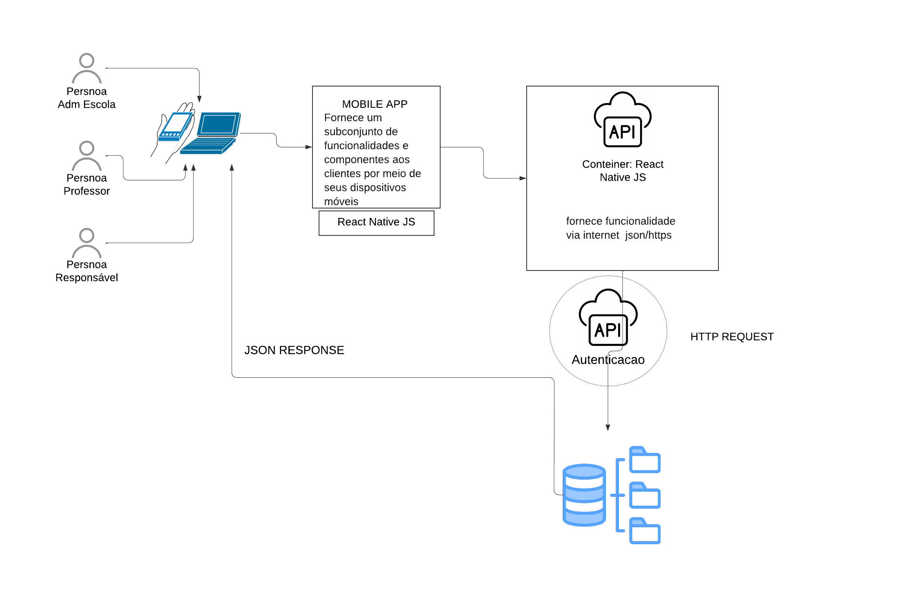
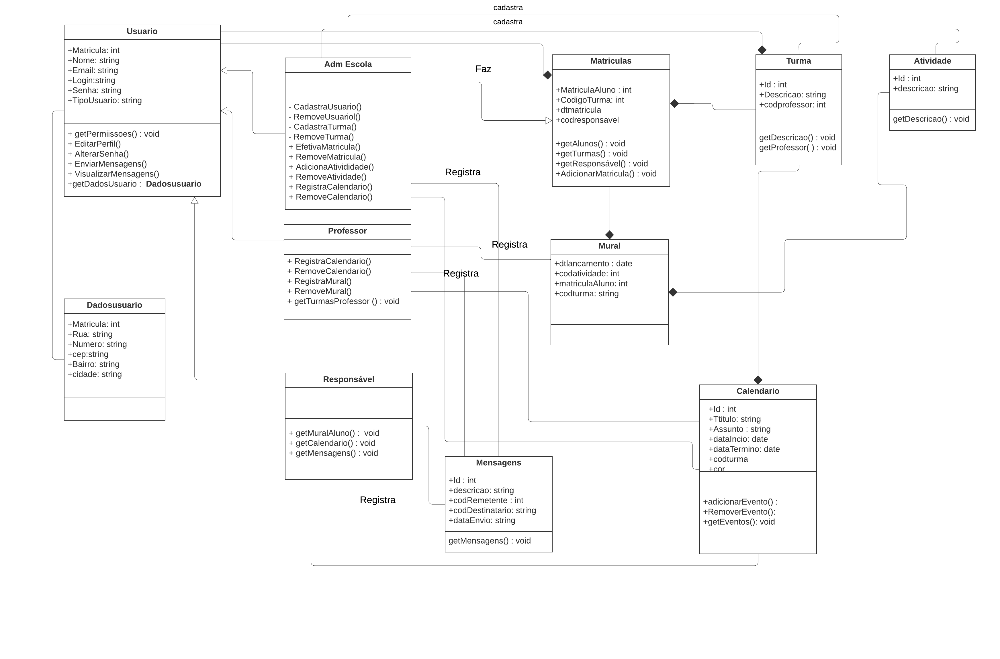
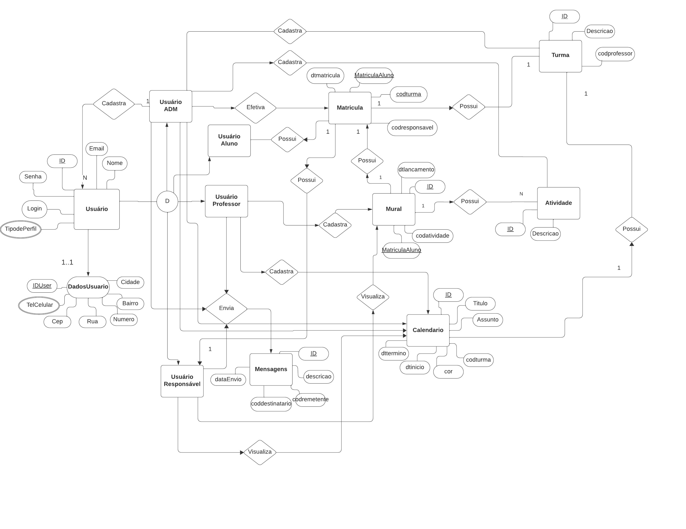

# Arquitetura da Solução

Pré-requisitos: <a href="3-Projeto de Interface.md"> Projeto de Interface</a>

Definição de como o software é estruturado em termos dos componentes que fazem parte da solução e do ambiente de hospedagem da aplicação.

MOBILE APP EDUSYNC / API EDUSYNC

*Frontend (React Native):

> -Telas (Screens)
> - Componentes de UI Reutilizáveis
> - Navegação (React Navigation)
> - Estado Global (Context API ou Redux)
 
 *Backend (SQLite e Arquivos JSON):
 
> - SQLite (Banco de Dados Local):
> - Armazena dados essenciais localmente no dispositivo.
> - Arquivos JSON (Simulação de API):
Representam dados simulados de uma API RESTful para complementação das  informações e futuras implementações.

## Diagrama de Classes

O diagrama de classes ilustra graficamente como será a estrutura do software, e como cada uma das classes da sua estrutura estarão interligadas. Essas classes servem de modelo para materializar os objetos que executarão na memória.

## Modelo ER

O Modelo ER representa através de um diagrama como as entidades (coisas, objetos) se relacionam entre si na aplicação interativa.]

As referências abaixo irão auxiliá-lo na geração do artefato “Modelo ER”.

> - [Como fazer um diagrama entidade relacionamento | Lucidchart](https://www.lucidchart.com/pages/pt/como-fazer-um-diagrama-entidade-relacionamento)

## Esquema Relacional

O Esquema Relacional corresponde à representação dos dados em tabelas juntamente com as restrições de integridade e chave primária.

## Modelo Físico
Arquivo de script sql para criação das tabelas do banco de dados.

<a href="/src/bd.sql">Diretório</a>

## Tecnologias Utilizadas

Iremos utilizar as seguimentes ferramentas para o desenvolvimento da aplicação mobile:

| Categoria  | Tecnologia |
| ------------- | ------------- |
| Linguagem  | JavaScript  |
| Framework  | ReactNative |
| IDE  | Visual Studio Code |
| Banco de dados	  | Microsoft Azure SQL Database |
| Ferramentas de versionamento	  | Git |
| Ferramentas de Gestão de Projeto	  | Github |
| Ferramentas Wireframes	  | Figma |
| Ferramentas de Comunicação	  | WhatsApp, Canvas e Teams |

## Hospedagem
 
O site utiliza a plataforma do Github Pages como ambiente de hospedagem do site do projeto.
A publicação do site do Github Pages é feita por meio de uma submissão do projeto (push) via git para o repositório que se encontra no endereço: https://github.com/ICEI-PUC-Minas-PMV-ADS/pmv-ads-2024-1-e3-proj-mov-t3-EduSync

## Qualidade de Software

A qualidade de software é essencial para garantir que a Agenda Digital Escolar atenda às necessidades e expectativas dos usuários de forma eficiente e satisfatória. Considerando os atributos fundamentais da qualidade de software, podemos destacar os seguintes pontos específicos relacionados ao projeto:

**Funcionalidade:** A Agenda Digital deve ser capaz de oferecer funcionalidades como troca de mensagens entre escola, professores e pais, integração de calendário escolar, atualizações diárias sobre o desempenho dos alunos.

**Confiabilidade:** É crucial que o sistema seja confiável, garantindo um desempenho consistente e evitando falhas inesperadas, especialmente em momentos críticos, como durante a troca de mensagens ou o acesso a informações importantes.

**Usabilidade:** A interface da Agenda Digital deve ser intuitiva e amigável, facilitando o uso para todos os usuários, independentemente de sua experiência técnica. Isso inclui a navegação fácil pelo calendário, a troca de mensagens e a visualização de relatórios de progresso.

**Eficiência:** O sistema deve ser eficiente em termos de tempo de resposta e consumo de recursos, garantindo uma experiência de usuário fluida e sem interrupções, mesmo durante períodos de alta demanda, como no início do ano letivo ou durante eventos escolares importantes.

**Manutenção:** É importante que a Agenda Digital seja facilmente mantida e atualizada ao longo do tempo, permitindo a introdução de novas funcionalidades, correções de bugs e adaptações às necessidades em evolução da escola e dos usuários.
