# Template Padrão da Aplicação

Layout padrão da aplicação que será utilizado em todas as páginas com a definição de identidade visual, aspectos de responsividade e iconografia.

## Paleta de cores:

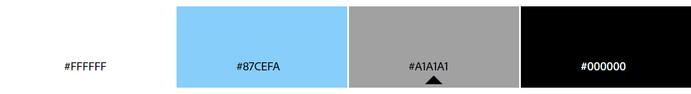

 

## Ícones:

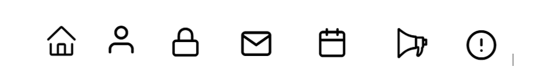

 

## Logo:

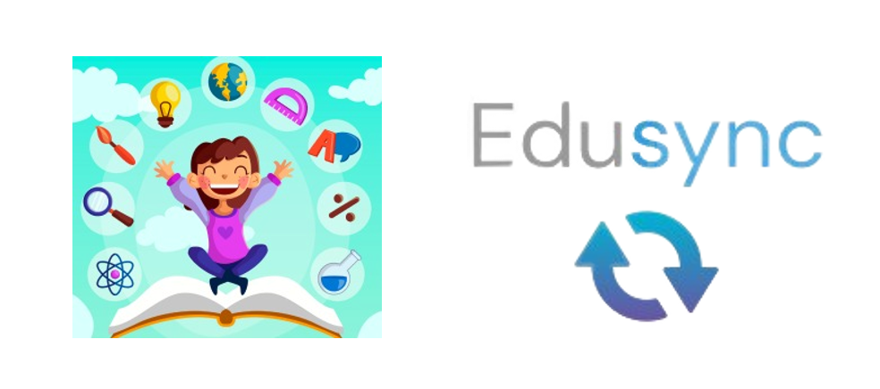

 

## Home page:

Ao entrar no aplicativo, o usuário será recebido pela página de boas-vindas, que apresenta uma mensagem inspiradora. Quando o usuário estiver pronto para começar, ele deve clicar em 'Acessar' para ser redirecionado à página de login.

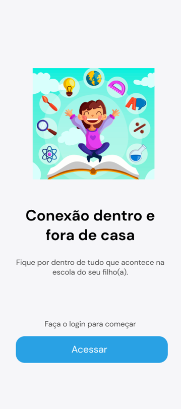

 

## Login:

Na página de login, o usuário pode acessar sua conta inserindo suas credenciais. Se já possui uma conta registrada, basta inserir seu nome de usuário e senha nos campos correspondentes e clicar em 'Entrar'. No entanto, se é um novo usuário, será necessário entrar em contato com a escola para que possa ser criada uma conta para ele.

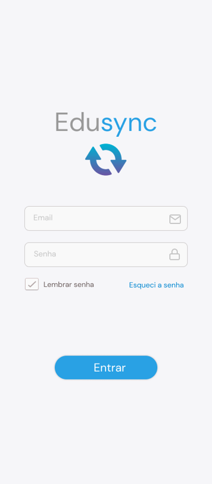

 

## Recuperar Senha:

Caso tenha esquecido sua senha, você pode recuperá-la facilmente na página de login. Basta clicar no link ou botão 'Recuperar Senha' e seguir as instruções fornecidas.

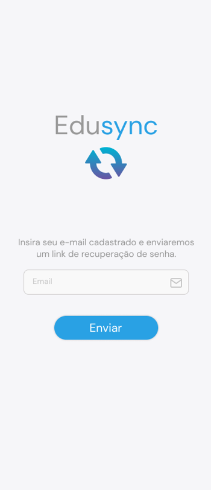

 

# Home page com login:

Em nossa página de login, você terá acesso rápido e fácil às principais funcionalidades da nossa plataforma:

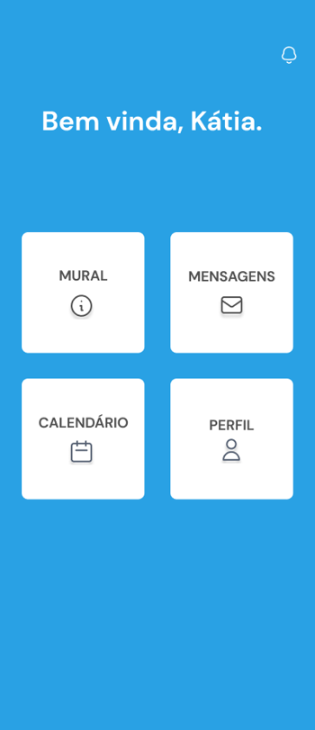

 

## Perfil:

O usuário tem a capacidade de acessar e gerenciar suas informações pessoais, garantindo que elas estejam sempre atualizadas. Isso é essencial para evitar qualquer contratempo decorrente de dados desatualizados.

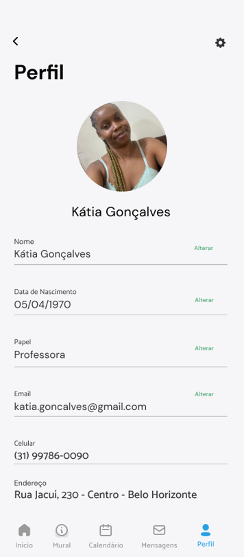

 

## Mural:

Em nossa página de Mural o usuario ficara por dentro das últimas novidades, anúncios e eventos importantes na escola de seu filho. Mantendo-se atualizado sobre tudo o que está acontecendo na comunidade escolar.

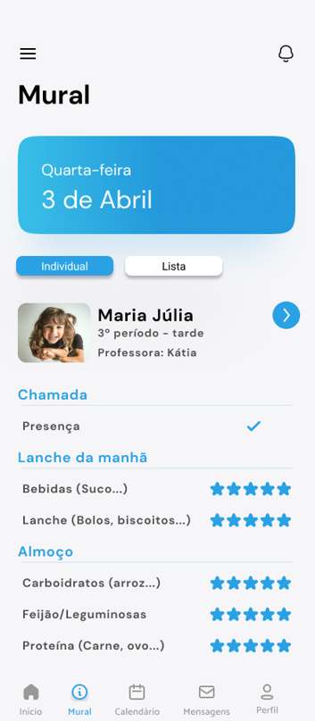

 

## Calendário:

O usuário poderá visualizar eventos, feriados escolares e datas importantes no calendário. Com essa funcionalidade, ele poderá planejar seu tempo com antecedência e garantir que nunca perca um evento escolar crucial.

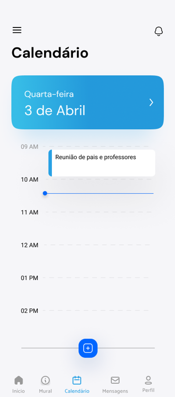

 

## Página de mensagens:

O usuário poderá utilizar o sistema de mensagens para entrar em contato com a escola e os professores de forma fácil e direta. Ele poderá enviar mensagens para esclarecer dúvidas, obter informações importantes e manter uma comunicação eficiente com a instituição educacional.

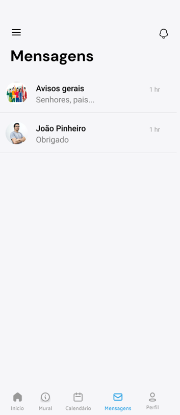

 

## Página de notificações:

 O usuário podera visualizar todas as atualizações importantes, como mensagens recebidas, novos eventos agendados, avisos da escola e outras informações relevantes. As notificações são uma forma conveniente de se manter informado sobre o que está acontecendo na comunidade escolar, garantindo que nada passe despercebido.

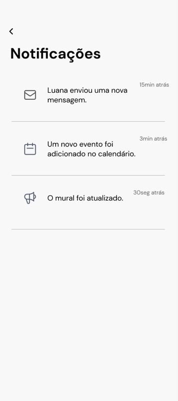

 
